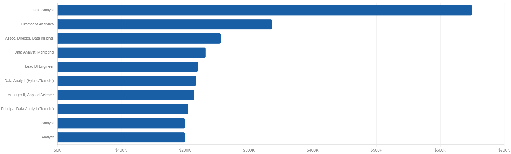
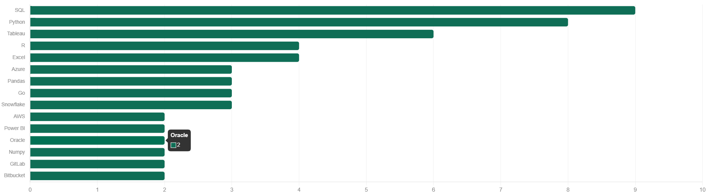
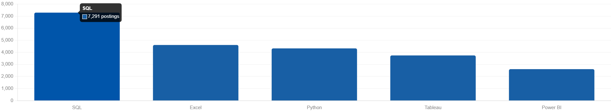
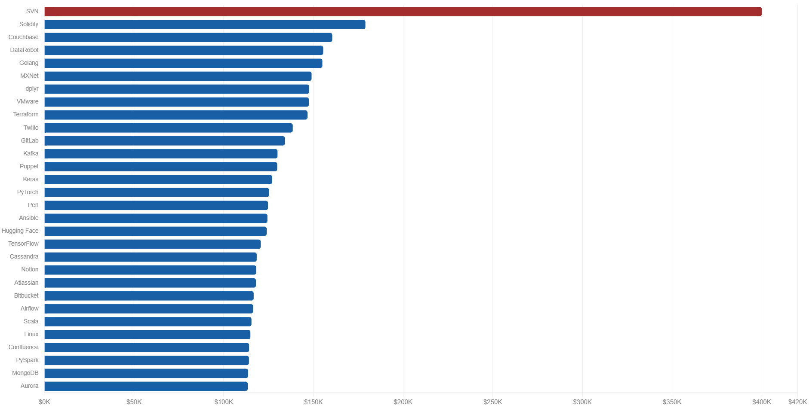
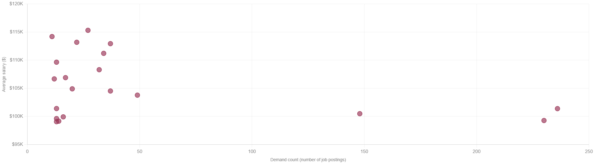

# SQL Data Analyst Job Market Analysis

Exploring the 2023 data analyst job market through SQL — uncovering the highest-paying roles, the skills attached to them, and which skills offer the best balance of demand and pay.

## Introduction

This project dives into the data analyst job market using SQL, with a focus on remote, top-paying positions. The goal was to answer a simple but practical question: **which skills are actually worth learning if you want a high-paying data analyst role?**

Each query in this repository targets a specific angle on that question — from identifying the highest-paying job postings to spotting the skills that show up most often in those listings, to balancing demand against salary to find the most "optimal" skills to invest time in.

All queries and underlying data can be found in the [project_sql folder](/sql_project/) folder of this repository.

## Background

The data comes from a database of job postings covering data-related roles in 2023, including job titles, salaries, locations, and the skills tied to each posting via a normalized skills table. The dataset was filtered throughout this analysis to focus on:

- Data analyst roles (and closely related titles)
- Remote positions (`job_location = 'Anywhere'`)
- Postings with a disclosed average yearly salary

### Questions I wanted to answer through SQL:

1. What are the top-paying data analyst jobs?
2. What skills are required for these top-paying jobs?
3. What skills are most in demand for data analysts?
4. Which skills are associated with higher salaries?
5. What are the most optimal skills to learn (high demand and high pay)?

## Tools I used

- **SQL (PostgreSQL)** — the core of the analysis; used to query, join, and aggregate the job postings data.
- **PostgreSQL** — database management system used to host the job postings dataset.
- **Visual Studio Code** — for writing and organizing SQL scripts.
- **Git & GitHub** — for version control and sharing this analysis.

# Analysis

Each query below tackled a specific aspect of the data analyst job market. Here's what I found.

### Top paying Data Analyst jobs

To find the highest-paying roles, I filtered for data analyst positions with a disclosed salary that were fully remote, then sorted by average yearly salary.

```sql
SELECT
    job_id,
    job_title,
    job_location,
    job_schedule_type,
    cd.name as company_name,
    salary_year_avg,
    job_posted_date
FROM job_postings_fact jpf
LEFT JOIN company_dim cd ON
    jpf.company_id = cd.company_id
WHERE
    job_title_short LIKE '%Analyst%' AND
    job_location = 'Anywhere' AND
    salary_year_avg IS NOT NULL
ORDER BY
    salary_year_avg DESC
LIMIT 10;
```
**Findings:**



- The top salary in the dataset reached **$650,000** — more than double the next-highest entry. This is a notable outlier worth treating with some caution rather than as a representative market rate.
- The second-highest role came in at **$336,500**, a steep drop from the top result but still well above the rest of the list.
- Beyond the top two, salaries settle into a more consistent band between **$200K and $256K**, suggesting this is a more realistic ceiling for top-tier remote analyst roles once outliers are excluded.
- Two separate postings landed at an identical **$200,000**, suggesting some employers work from standardized pay bands for analyst-level titles.
- Job titles vary widely even within "top-paying analyst roles" — ranging from individual-contributor titles like *Data Analyst* to leadership and applied-science titles like *Director of Analytics* and *Manager II, Applied Science* — showing that high pay isn't limited to senior leadership titles alone, and that "analyst" as a category spans a broad range of seniority levels.

### Skills for top paying jobs

Next, I joined the top 10 highest-paying Data Analyst postings against the skills table to see what was actually required for those roles.

```sql
WITH top_paying_jobs AS (
    SELECT
        job_id,
        job_title,
        salary_year_avg
    FROM
        job_postings_fact
    WHERE
        job_id IN (SELECT job_id FROM skills_job_dim)
        AND job_title_short = 'Data Analyst'
        AND salary_year_avg IS NOT NULL
        AND job_location = 'Anywhere'
    ORDER BY
        salary_year_avg DESC
    LIMIT 10
)
SELECT
    top_paying_jobs.job_id,
    job_title,
    salary_year_avg,
    skills
FROM
    top_paying_jobs
    INNER JOIN
    skills_job_dim ON top_paying_jobs.job_id = skills_job_dim.job_id
    INNER JOIN
    skills_dim ON skills_job_dim.skill_id = skills_dim.skill_id
ORDER BY
    salary_year_avg DESC;
```

**Findings:**


 _The bar graph shows the highest paying job postings in 2023. Claude provided the chart with my sql query result._

- **SQL appears in 9 of the 10 top-paying roles**, making it the closest thing to a universal requirement at this pay level.
- **Python** follows close behind, required in 8 of 10 roles — together, SQL and Python form the backbone of nearly every top-paying job in this list.
- **Tableau** is the dominant visualization tool, appearing in 6 of 10 postings — well ahead of Power BI (2 postings).
- **Cloud and data warehousing skills carry weight at the top end** — Azure, AWS, and Snowflake each appear in 3 of the 10 roles, and the single highest-paying role in this group required Azure, AWS, *and* Databricks together — pointing to cloud fluency as a key differentiator at the top of the pay scale.
- **The number of required skills varies dramatically by role** — one posting listed 14 distinct skills (including Jira, Confluence, Bitbucket, and SAP), while another listed only 3 (SQL, Python, R). More required skills didn't necessarily mean higher pay.
- **Collaboration and DevOps tools cluster together** — Jira, Confluence, Bitbucket, and Atlassian tend to appear as a group in the same postings, suggesting these roles are embedded in larger engineering organizations with established workflows.

### In-Demand Skills for Data Analysts

To find which skills show up most often across *all* remote data analyst postings (not just the top-paying ones), I counted skill mentions across the full dataset.

```sql
SELECT skills,
    COUNT(skills_job_dim.job_id) as total_demand
FROM job_postings_fact
INNER JOIN
    skills_job_dim ON job_postings_fact.job_id = skills_job_dim.job_id
    INNER JOIN
    skills_dim ON skills_job_dim.skill_id = skills_dim.skill_id
WHERE job_title_short = 'Data Analyst'
      AND job_location = 'Anywhere'
GROUP BY skills
ORDER BY total_demand DESC
LIMIT 5;
```

**Findings:**


 _The bar graph shows the most in demand skills for a data analyst to have in 2023. Claude provided the chart with my sql query result._

 **Top 5 most in-demand skills:**

| Rank | Skill | Total demand (postings) |
|------|-------|--------------------------|
| 1 | SQL | 7,291 |
| 2 | Excel | 4,611 |
| 3 | Python | 4,330 |
| 4 | Tableau | 3,745 |
| 5 | Power BI | 2,609 |

- **SQL is the single most in-demand skill by a wide margin**, appearing in **7,291 job postings** — nearly 60% more than the next closest skill.
- **Excel** comes in second with **4,611 postings**, a reminder that despite the rise of BI tools, spreadsheet fluency is still a core expectation for data analysts.
- **Python** (4,330 postings) and **Tableau** (3,745 postings) round out the core technical and visualization skills employers ask for most.
- **Power BI** (2,609 postings) trails Tableau by over 1,100 postings, suggesting Tableau currently has the edge in employer preference, at least within this dataset.
- Together, these five skills — SQL, Excel, Python, Tableau, and Power BI — represent the foundational toolkit that shows up across the broadest range of data analyst job postings, regardless of salary tier.

### Skills based on Salary

This query looked purely at average salary per skill across all Data Analyst postings with a disclosed salary, regardless of location or demand.

```sql
SELECT skills,
    ROUND(AVG(salary_year_avg), 2) AS average_salary
FROM job_postings_fact
INNER JOIN
    skills_job_dim ON job_postings_fact.job_id = skills_job_dim.job_id
INNER JOIN
    skills_dim ON skills_job_dim.skill_id = skills_dim.skill_id
WHERE job_title_short = 'Data Analyst'
      AND salary_year_avg IS NOT NULL
GROUP BY skills
ORDER BY average_salary DESC
LIMIT 30;
```

**Findings:**


 _The bar graph shows the highest payable skills for a data analyst to have in 2023. Claude provided the chart with my sql query result._

 **Top 10 highest-paying skills:**

| Rank | Skill | Average salary |
|------|-------|----------------|
| 1 | SVN | $400,000.00 |
| 2 | Solidity | $179,000.00 |
| 3 | Couchbase | $160,515.00 |
| 4 | DataRobot | $155,485.50 |
| 5 | Golang | $155,000.00 |
| 6 | MXNet | $149,000.00 |
| 7 | dplyr | $147,633.33 |
| 8 | VMware | $147,500.00 |
| 9 | Terraform | $146,733.83 |
| 10 | Twilio | $138,500.00 |

- **SVN** tops the list at an average of **$400,000** — a striking outlier given it's a largely outdated version control tool. This is almost certainly driven by a small number of unusual, high-paying postings rather than genuine market demand for SVN specifically, and should be treated as an anomaly rather than a trend.
- Excluding SVN, the next tier is led by **Solidity** ($179,000) and **Couchbase** ($160,515) — niche, specialized skills tied to blockchain development and NoSQL database architecture.
- **Infrastructure and DevOps tools pay surprisingly well** for "data analyst" roles — Terraform ($146,733.83), VMware ($147,500), Puppet ($129,820), and Ansible ($124,370) all rank in the top half of this list, suggesting the highest-paying postings often blend traditional analyst work with platform or DevOps engineering.
- **Deep learning frameworks cluster tightly together** — Keras ($127,013.33), PyTorch ($125,226.20), Hugging Face ($123,950), and TensorFlow ($120,646.83) all sit within about $7,000 of each other, indicating the market prices general ML framework knowledge fairly consistently rather than rewarding one framework over another.
- **Big data and collaboration tools make up the lower end of this top-30 list** — Kafka, Cassandra, Airflow, PySpark, MongoDB, and the Atlassian suite (Confluence, Bitbucket, Atlassian, Jira from earlier sections) all land between roughly between $110,000 and $130,000, forming a dependable but less differentiated salary tier.
- Excluding the SVN outlier, the average salary across this top-30 list is closer to **$130,770**, which is a more realistic benchmark than the **$139,745** average that includes it.

### Most optimal skills to learn

Finally, I combined demand and salary into a single view — filtering for remote roles with disclosed salaries, and requiring each skill to appear in more than 10 postings to filter out statistical noise from rarely-requested skills.

```sql
SELECT skills_dim.skill_id,
       skills,
       COUNT(skills_job_dim.job_id) AS demand_count,
       ROUND(AVG(salary_year_avg),2) AS avg_salary
FROM job_postings_fact
INNER JOIN
    skills_job_dim ON job_postings_fact.job_id = skills_job_dim.job_id
INNER JOIN
    skills_dim ON skills_job_dim.skill_id = skills_dim.skill_id
WHERE job_title_short = 'Data Analyst'
      AND salary_year_avg IS NOT NULL
      AND job_work_from_home IS TRUE
GROUP BY
    skills_dim.skill_id
HAVING
    COUNT(skills_job_dim.job_id) > 10
ORDER BY
    avg_salary DESC,
    demand_count DESC
LIMIT 20;
```

 _The scatter plot shows the most optimal skills for a data analyst to have in 2023. Claude provided the chart with my sql query result._

 **Top 10 most optimal skills (balancing demand and salary):**

| Rank | Skill | Demand count | Average salary |
|------|-------|---------------|----------------|
| 1 | Go | 27 | $115,319.89 |
| 2 | Confluence | 11 | $114,209.91 |
| 3 | Hadoop | 22 | $113,192.57 |
| 4 | Snowflake | 37 | $112,947.97 |
| 5 | Azure | 34 | $111,225.10 |
| 6 | BigQuery | 13 | $109,653.85 |
| 7 | AWS | 32 | $108,317.30 |
| 8 | Java | 17 | $106,906.44 |
| 9 | SSIS | 12 | $106,683.33 |
| 10 | Jira | 20 | $104,917.90 |

**Findings:**

- **Python and R offer the best combination of high demand and solid pay** — Python leads with **236 postings** at an average salary of **$101,397.22**, and R follows with **148 postings** at **$100,498.77**. Despite being two of the most commonly requested skills, they still command competitive salaries.
- **Tableau shows the same pattern at scale** — **230 postings** at **$99,287.65** — confirming it as a safe, high-volume skill to learn even though its average pay sits slightly below Python and R.
- **Go stands out as a high-paying skill in a remote-analyst context** — only **27 postings**, but the highest average salary on this list at **$115,319.89** — suggesting it's a differentiator rather than a baseline expectation.
- **Cloud and warehousing skills offer a strong middle ground** — Snowflake (37 postings, $112,947.97), Azure (34 postings, $111,225.10), and AWS (32 postings, $108,317.30) all combine moderate demand with above-average pay, making them efficient skills to prioritize after the SQL/Python/Tableau core.
- **Looker has the highest demand among the niche BI tools** on this list (49 postings) while still paying competitively at $103,795.30 — worth considering as a Tableau/Power BI alternative depending on the employer.
- **Lower-demand tools like Confluence (11 postings) and Hadoop (22 postings) still pay well** ($114,209.91 and $113,192.57 respectively), but their limited postings mean they're better thought of as complementary skills rather than primary ones to build a career around.
## What I learned

Working through this project sharpened my SQL skills in several concrete ways:

- **Complex query construction** — combining multiple `INNER JOIN`s and a `WITH` clause (CTE) to break a multi-step problem into a clean, readable pipeline.
- **Aggregation in practice** — using `GROUP BY` alongside aggregate functions like `COUNT()` and `ROUND(AVG(...), 2)` to turn row-level data into meaningful summary statistics.
- **Filtering with intent** — applying `WHERE`, `HAVING`, and subqueries (e.g. `job_id IN (SELECT job_id FROM skills_job_dim)`) together to isolate exactly the right population of job postings before aggregating.
- **Translating a business question into SQL** — the hardest part of this project wasn't writing SQL syntax, it was deciding *which* filters and joins actually answered the underlying question (e.g. demand alone, salary alone, or demand **and** salary together).

## Insights

- **SQL is non-negotiable.** It's the most in-demand skill overall (7,291 postings) and appears in 9 of the 10 highest-paying roles — there's no path to a competitive data analyst role that skips it.
- **A small core toolkit covers most of the market.** SQL, Python, Excel, and Tableau together account for the large majority of what employers ask for, both in top-paying and general postings.
- **High pay and high demand aren't always aligned.** Skills like Go and Confluence pay well despite low demand, while Python and Tableau pay competitively *because* of high demand — there are multiple viable strategies depending on whether you want breadth or a differentiator.
- **Outliers can distort salary-only analysis.** The SVN figure ($400,000) and the Mantys job posting ($650,000) are both extreme enough that they shouldn't be read as representative trends — they're useful as curiosities, not benchmarks.
- **The most senior or highest-paid roles increasingly blend disciplines.** Several top-paying postings required cloud platforms, DevOps tools, and collaboration software alongside core analyst skills — suggesting the boundary between "data analyst" and adjacent engineering roles is blurring at the top of the pay scale.

## Conclusion

This analysis confirms what's often suspected anecdotally: **SQL, Python, and visualization tools like Tableau form the foundation of a competitive data analyst skill set**, while skills like cloud platforms (Azure, AWS, Snowflake) and select niche technologies offer a path to differentiate and command a higher salary. The "most optimal skills" — those balancing strong demand with strong pay — point to a clear, actionable roadmap: build the SQL/Python/Tableau core first, then layer in cloud and warehousing skills to stand out.

This project was a practical exercise in using SQL not just to query data, but to answer real career-relevant questions — and it reinforced how much insight can come from a handful of well-constructed queries.
